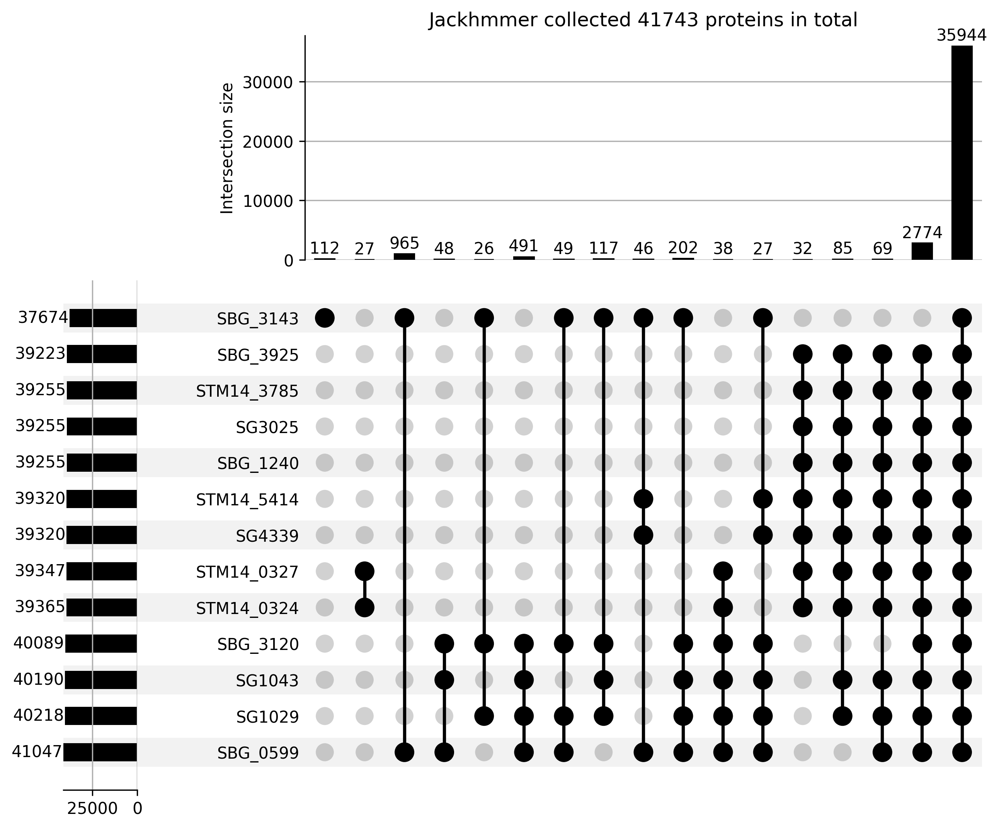

HCP project
==============

## To do list:  
- [x] Collect homologues of HCPs proteins.  
- [x] Cluster the homologues.  
- [ ] Build the MSA and the phylogenetic tree.  
- [ ] Collect the neighboors.  
- [ ] Classify the neighbrhoods.  


##  Collection of HCPs homologues .
20 iteration of  Jackhmmer searchs were performed against the NCBI nr database  with the follow seeds:  

```Bash
STM14_0324, STM14_0327, STM14_3785, STM14_5414, SG1043, SG1029, SG3025, SG4339, SBG_1240, SBG_3120, SBG_3143, SBG_0599, SBG_3925.  
```

### Jackhmmer result summary: 

|    Seed    | Start | End | Max iteration | Sequences | Proteins |
|:----------:|:-----:|:---:|:-------------:|:---------:|:--------:|
| STM14_0324 |       |     |    15         |   39502   |  39365   |
| STM14_0327 |       |     |    11         |   39492   |  39347   |
| STM14_3785 |       |     |    13         |   39394   |  39255   |
| STM14_5414 |       |     |    20         |   39452   |  39320   |
|   SG1043   |       |     |    20         |   40321   |  40190   |
|   SG1029   |       |     |    11         |   40357   |  40218   |
|   SG3025   |       |     |    13         |   39394   |  39255   |
|   SG4339   |       |     |    20         |   39452   |  39320   |
|  SBG_1240  |       |     |    17         |   39390   |  39255   |
|  SBG_3120  |       |     |    15         |   40212   |  40089   |
|  SBG_3143  |       |     |    20         |   37713   |  37674   |
|  SBG_0599  |       |     |    15         |   41167   |  41047   |
|  SBG_3925  |       |     |    16         |   39344   |  39223   |


The Intersection of each separeted collection:  


The full image could be seen [here](./data/Figures/up_set_jackhmmer/upset_full.png)


